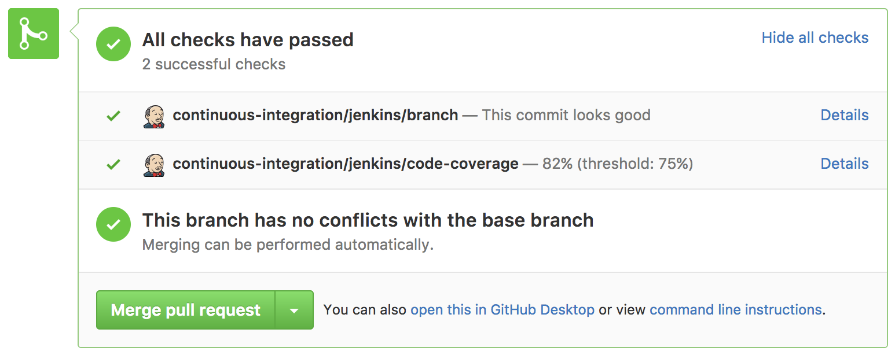

 [](http://www.apache.org/licenses/LICENSE-2.0)

A Jenkins 2.0 Pipeline library for automatically posting code coverage results to GitHub pull requests.

Currently supports:
 * input
   * jacoco html
 * output
   * github.com
   * github enterprise

## Example usage
In your Jenkinsfile:
```
@Library('github.com/spotify/jenkins-coverage-poster') _

stage("Run tests") {
  sh "mvn test"
}

stage("Post coverage") {
  postJacocoCoverage(threshold: 75)
}
```

## Example result



## Requirements

Your Jenkins must be version 2.0 or later and must define a Credential called `github-user-token`, which contains as password a valid GitHub api token. The Credential username can be anything, as it is not used. The token's permissions must allow read access to repositories and posting comments to pull requests at minimum.

## Code of conduct
This project adheres to the [Open Code of Conduct][code-of-conduct]. By participating, you are expected to honor this code.

[code-of-conduct]: https://github.com/spotify/code-of-conduct/blob/master/code-of-conduct.md
